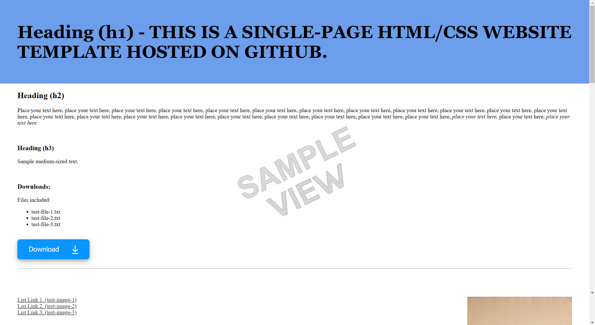

# A simple HTML website template for hosting on GitHub and elsewhere:

---

## Click on the link below to open and try out the template.

* [Click this link to view the website being created from this repository and hosted on github-pages.](https://boxbot6.github.io/simple-website-template-single-page-with-banner-v1/)

 

## To copy and use the template:
* Create a new folder on your computer and name it - this folder will be your new websites root directory folder.
* Use the green '\<\> Code' button at the top of this repository's github page to 'Download ZIP' of this repository.
* Unzip the download and copy the internal contents to the new folder keeping all its subfolders intact.
* This folder now contains your new website ready to be personalised by editing the contents as outlined in the section below and when you are happy with the results you can host it for free on GitHub (as shown further down on this page) or simply move the complete new root directory folder to wherever else you wish to host it.

## To Edit the Website:
* Open the copied index.html file from your new folder (using Notepad or another html editor) and edit the contents to create your own home page (A good beginners guide here: [HTML For Beginners The Easy Way: Start Learning HTML & CSS Today](https://html.com/)).
* (To test the website as you are editing it - click the index.html and it will open a browser window and show the results of your current edits - refresh this tab to update subsequent edits). 
* Add any images you wish to use to the images folder.
* Update and check all the links are working (see the links already included in the template for examples).
* Edit the .css file to change the website appearance and styles.
* Delete or \<\!\-\- comment out \-\-\> anything not needed.
* Edit the index.html files for any other pages if your website has more than one page (each pages index.html is located in their own subdirectory folder) - add your own content to each of these subsequent pages.
* When you are happy with everything upload or move the main root directory folder to where you wish to host it.

## Using Free Github Hosting: (size/usage limits apply)
* Sign in to your account on [Github.com](https://github.com/), go to 'Your repositories' and select 'New' (top right).
* In 'create a new repository' give the new repository a name (this name also applies to your website), add an optional description, keep check box 'Public' to make your repository and website visible to the general public online. (don't add a README file, .gitignore or Licence here, the relevant files will be added later).
* Press 'Create repository' at the bottom.
* This will take you to Quick setup, select 'uploading an existing file'
* On the next page drag and drop all the files and folders together from inside the new root directory folder that you made in 'To Use the Template' onto the upload section.
* Press 'Commit changes' at the bottom
* Check the new repository is shown to be Public (if not change the visibility in settings).
* Change the Licence now if you want to.
* Now use 'Settings' to open GitHub Pages (shown as Pages in the column on the left).
* Select Source - Deploy from a branch, select main, then save.
* Wait a few minutes for the website to be created - when its done the https address will be shown in github-pages - copy the link and update the README.md file to show the name of your new website and update the link to the one for this new site.

 

After creating your own website using this template and github-pages you can replace this README.md with something similar to that shown below but using your own sites name - update the https link beneath it to take you to your new websites address (your link will be shown in github-pages)). - you can then delete this comment!

# HTML Website Hosting For:

### your-website-name-here.

 

* [Click this link to view the website being created from this repository and hosted on github-pages.](https://boxbot6.github.io/simple-website-template-single-page-with-banner-v1/)
